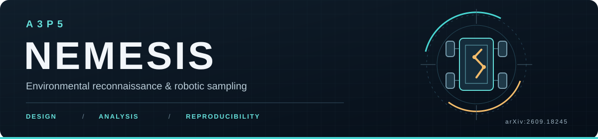
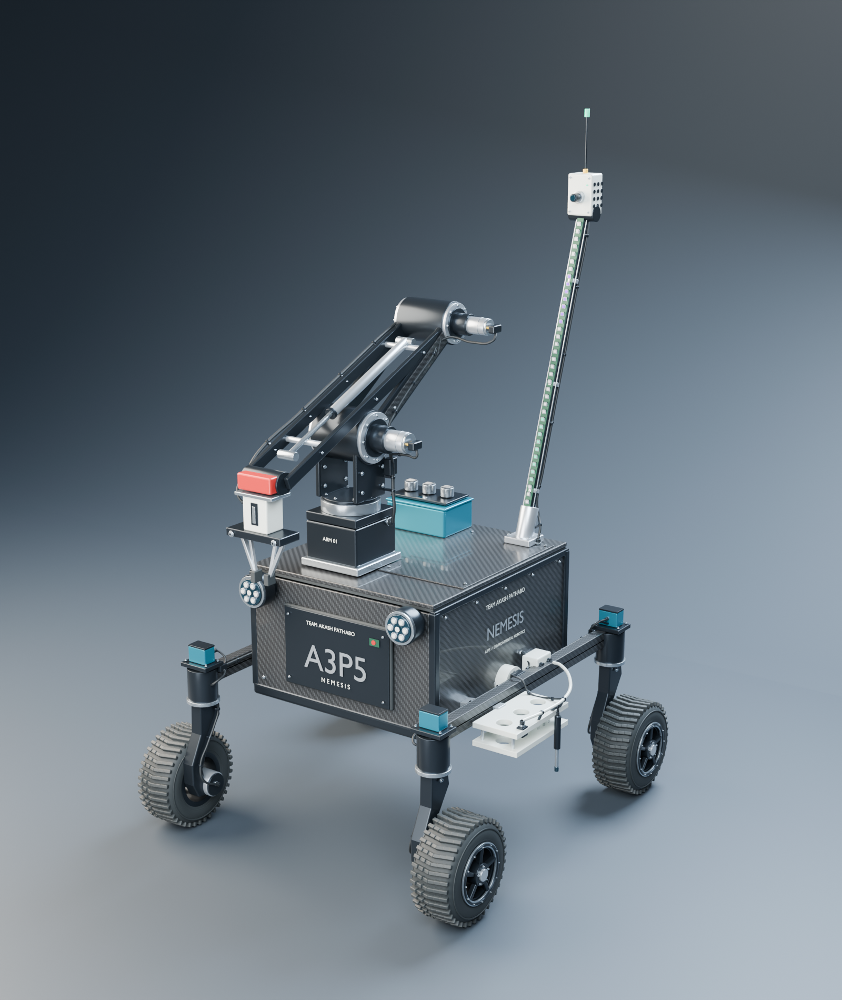
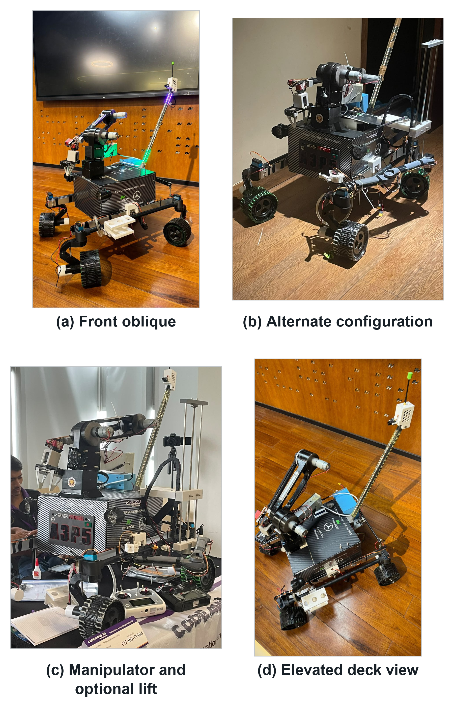
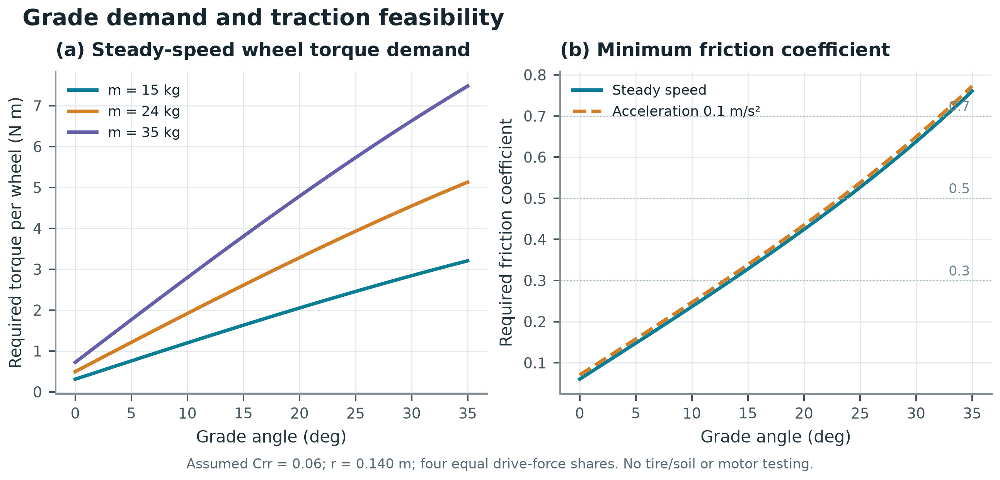
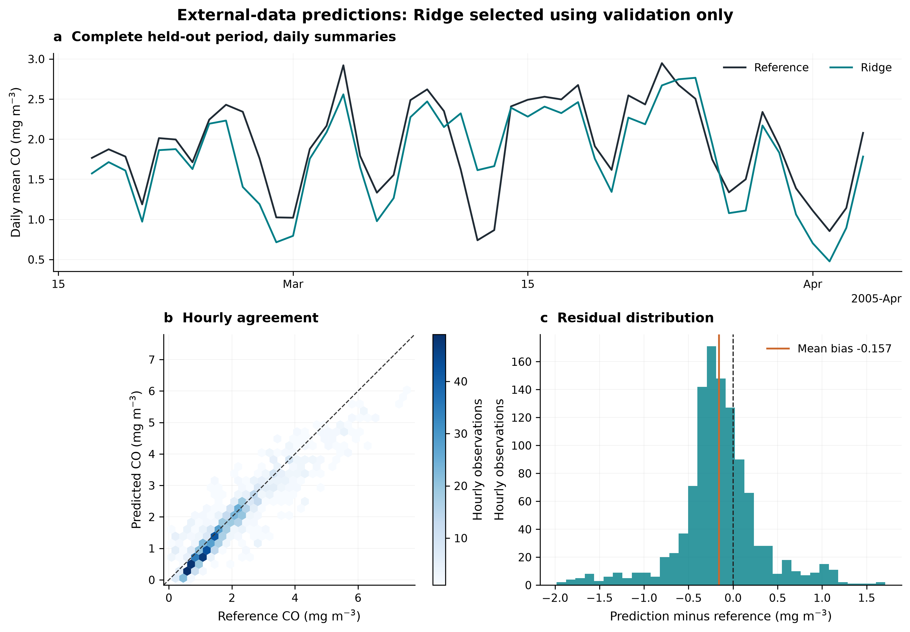
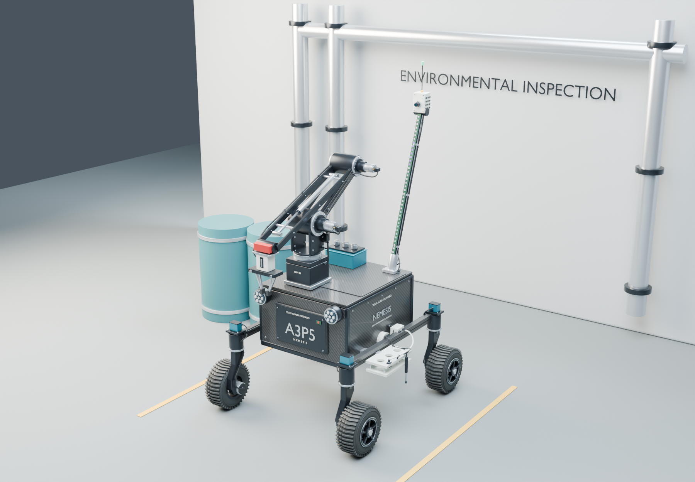
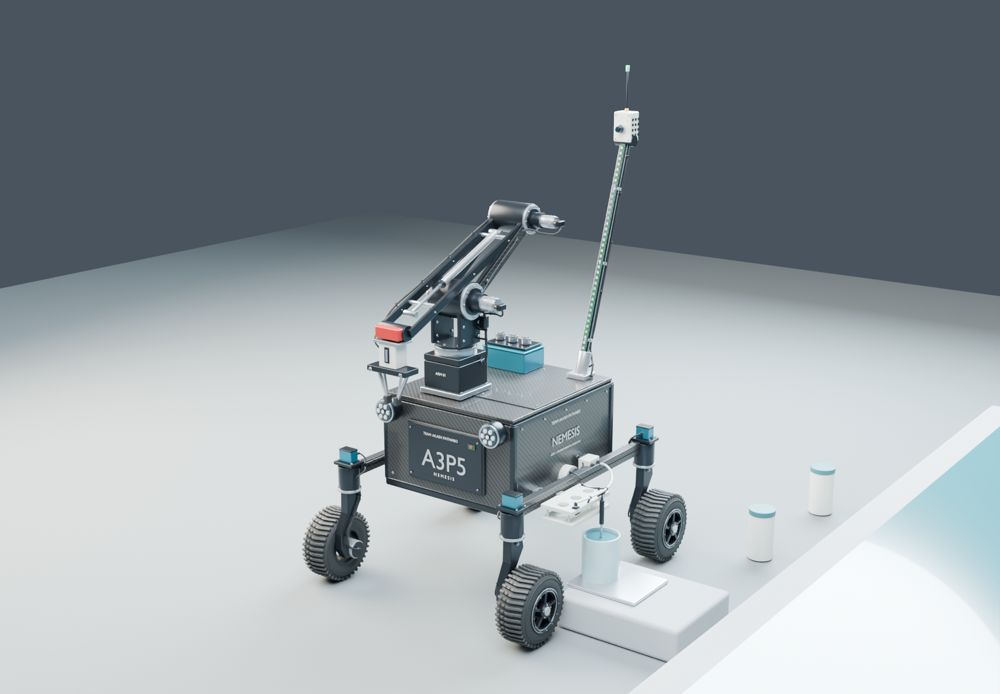
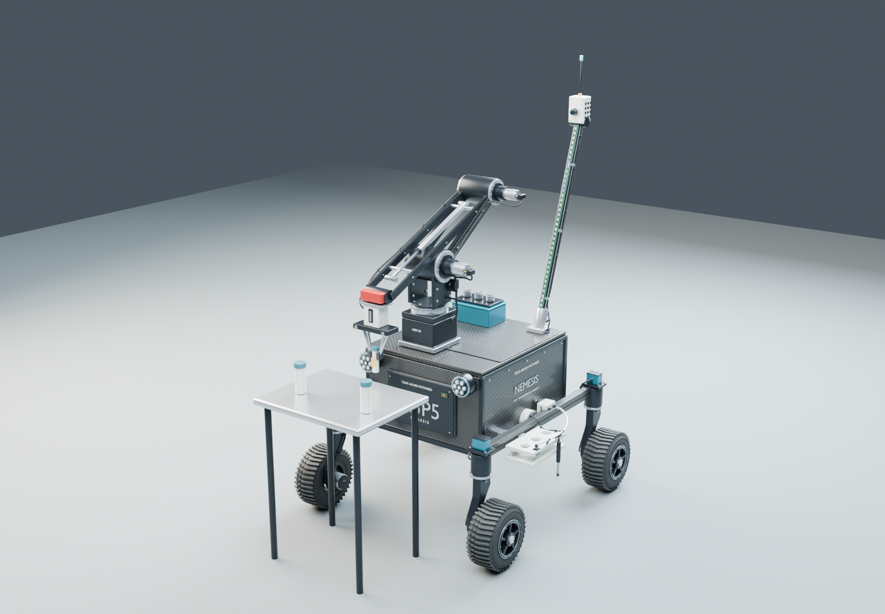

<div align="center">



**Environmental reconnaissance · Robotic sampling · Reproducible engineering**

[](https://arxiv.org/abs/2609.18245)
[](https://github.com/SABIKGIT/a3p5-nemesis/actions/workflows/verify.yml)
[](docs/reproduce.md)
[](manuscript/blender/)
[](CITATION.cff)

[Read the paper](https://arxiv.org/abs/2609.18245) · [Explore the calculations](docs/engineering-calculations.md) · [Reproduce the results](docs/reproduce.md) · [Cite this work](#citation)



*Blender design reconstruction based on reference photographs; proposed equipment layout.*

**Shafi Bin Sultan · Sabik Bin Sultan · Safwan Sadad**

</div>

## The project

A3P5 NEMESIS explores how a four-wheel rover can combine remote inspection, environmental observation and lightweight manipulation in one serviceable platform. This repository connects the prototype's visible configuration to an editable design study, engineering equations and a reproducible external-data calibration experiment.

The research companion to **[arXiv:2609.18245](https://arxiv.org/abs/2609.18245)** includes the manuscript, calculation scripts, numerical tables, benchmark inputs and outputs, editable Blender scenes and subsystem diagrams. This repository is maintained by **[Sabik Bin Sultan](https://github.com/SABIKGIT)**, a paper co-author and robotic-platform co-developer.

> **Research status:** the engineering results are predictions under declared assumptions. The machine-learning results use an external historical sensor dataset. Integrated rover field performance remains to be established.

## Explore the work

| Start with | What you will find |
|---|---|
| [Research paper](https://arxiv.org/abs/2609.18245) | Motivation, methods, equations, results and limitations |
| [Engineering calculations](docs/engineering-calculations.md) | Wheel motion, grade torque, stability, energy, sensor response and stopping clearance |
| [Calibration benchmark](manuscript/analysis/ml_outputs/methods_results_limits.md) | UCI Air Quality data, chronological evaluation, model selection and uncertainty |
| [Industrial model](A3P5_Nemesis_Industrial.blend) / [mission scenes](manuscript/blender/) | Editable Blender assets, source scripts and renders |
| [Subsystem diagrams](manuscript/diagrams/CANVA_PRINT_README.md) | Fourteen complete diagrams, figure mapping and source provenance |
| [Hardware validation plan](docs/hardware-validation-plan.md) | Measurement protocols and blank test records for future physical trials |
| [Editable manuscript](manuscript/latex/README.md) | Self-contained XeLaTeX/Overleaf project; [Word version](manuscript/final/A3P5_NEMESIS_Research_Manuscript.docx) also included |

## From prototype to analysis

<p align="center">
  
</p>

*Prototype reference photographs. The Blender reconstruction and proposed mission scenes are documented separately from these physical images.*

| Engineering model | External-data experiment |
|:---:|:---:|
|  |  |
| How grade and assumptions change drive requirements | How a frozen calibration model performs on later observations |

<details>
<summary><strong>Explore the proposed mission scenes</strong></summary>

These Blender illustrations explore possible mission arrangements. They are design studies; no field-trial performance is implied.

| Mission study 01 | Mission study 02 | Mission study 03 |
|:---:|:---:|:---:|
|  |  |  |

[Browse all scenes and editable model](manuscript/blender/) · [Inspect the wiring illustration](A3P5_Nemesis_Wiring_Detail.png)

</details>

## Selected results

| Question | Reported result | Scope |
|---|---:|---|
| Wheel output torque on a 20° grade | **3.28 N·m / wheel** | 24 kg scenario, four-wheel equal sharing, rolling coefficient 0.06 |
| Endurance at that grade | **1.72 h** | Assumed battery and load model; not measured runtime |
| Front tipping bound with a 2 kg payload | **32.66°** | Static geometric prediction; not a safe operating limit |
| Validation-selected Ridge test RMSE | **0.502 mg/m³** | External UCI carbon-monoxide data; not rover sensor accuracy |
| Ridge RMSE 95% interval | **0.435–0.569 mg/m³** | 2,000 calendar-day bootstrap resamples, conditional on the fitted model |

The benchmark retains **7,344 eligible observations** with **eight predictors**, split chronologically into **5,140 training / 1,102 validation / 1,102 test** observations. Preprocessing is fitted on training data only. Validation selects the model before frozen test evaluation; no training-plus-validation refit is performed.

Full precision, assumptions and numerical outputs are preserved in the [engineering tables](manuscript/analysis/tables/) and [benchmark archive](manuscript/analysis/ml_outputs/).

## Run the verification

Clone the repository and run the checks from its root. These first two verification commands use only the Python standard library:

```bash
git clone https://github.com/SABIKGIT/a3p5-nemesis.git
cd a3p5-nemesis
python scripts/manifest.py --check
python scripts/verify.py
```

For engineering regeneration, saved-model replay and optional retraining, install the recorded scientific environment:

```bash
python -m venv .venv
# macOS/Linux:
source .venv/bin/activate
# Windows PowerShell instead: .venv\Scripts\Activate.ps1
python -m pip install -r requirements.txt
python scripts/verify.py --models
python scripts/verify.py --refit --regenerate-engineering --json verification/local-results.json
```

See the [reproduction guide](docs/reproduce.md) for environment details and the [testing guide](docs/TESTING.md) for check coverage. Full replay uses the recorded library versions; checks of stored numerical tables do not require loading serialized models.

**Verified on 23 September 2026:** all **23 checks passed**, with no skips, using the recorded Python 3.12 scientific environment. This includes saved-model replay, all 21 candidate refits, seeded bootstrap replay and engineering-table regeneration. See the fresh [publication report](verification/publication-checks.json) and the original [prepublication report](verification/prepublication_tests.json). These checks cover software and numerical reproducibility; physical rover trials remain future work. The badge above shows the current GitHub Actions status.

## What the evidence supports

| Material | Evidence provided |
|---|---|
| Prototype photographs | Visible hardware configuration |
| Equations, scripts and numerical tables | Reproducible calculations under declared assumptions |
| External-data benchmark | Calibration-method evaluation on the historical UCI sensor array |
| Blender assets | Geometric reconstruction and proposed mission arrangements |
| Hardware protocols and blank logs | Planned measurements; no completed field-trial results |

Autonomous navigation, deployed ROS/firmware and certified operating limits are not established by this release. The carbon-pattern model finish is a visual reconstruction, not verification of composite construction.

## Repository guide

| Location | Contents |
|---|---|
| `docs/` | Methods, reproduction instructions and hardware-validation protocols |
| `manuscript/analysis/` | Engineering/ML scripts, tables, plots, predictions and fitted models |
| `manuscript/research/` | Source data, reference metadata and provenance |
| `manuscript/blender/` | Mission-study model, render scripts and images |
| `manuscript/diagrams/` | Diagram sources, exports and attribution |
| `manuscript/latex/`, `manuscript/final/` | Editable paper and publication assets |
| `tests/`, `scripts/` | Verification and distribution-integrity utilities |
| `verification/` | Recorded checks and file manifest |

## Authors and contributions

| Author | Contribution recorded in the paper |
|---|---|
| **Shafi Bin Sultan** — St. Joseph Higher Secondary School | Engineering planning, coordination, supervision, fundraising and ROS/system-integration support |
| **Sabik Bin Sultan** — BAF Shaheen College Kurmitola | Robotic-platform development under Shafi's guidance; collaboration and fundraising |
| **Safwan Sadad** — Greenland Residential School | Robotic-platform development under Shafi's guidance; collaboration and fundraising |

The manuscript acknowledges US$3,000 from Prime Now and US$2,000 from Mercedes-Benz Bangladesh, plus project collaboration with Mercedes-Benz Bangladesh and Prime Bank. These are the authors' project acknowledgements.

## Citation

```bibtex
@misc{sultan2026a3p5nemesis,
  title = {A3P5 NEMESIS Integrated Rover Design for Environmental Reconnaissance and Robotic Sampling with Reproducible Mobility Analysis and an External Data Machine Learning Calibration Benchmark},
  author = {Shafi Bin Sultan and Sabik Bin Sultan and Safwan Sadad},
  year = {2026},
  eprint = {2609.18245},
  archivePrefix = {arXiv},
  primaryClass = {cs.RO},
  url = {https://arxiv.org/abs/2609.18245}
}
```

[CITATION.bib](CITATION.bib) is ready to import, and [CITATION.cff](CITATION.cff) provides machine-readable citation information. Cite the external dataset and reused figures separately when using those materials.

## Reuse and contributions

Original project materials retain their existing rights; this repository does not introduce a blanket open-source license. See [LICENSE_STATUS.md](LICENSE_STATUS.md), [DATA_SOURCES.md](DATA_SOURCES.md) and [THIRD_PARTY_NOTICES.md](THIRD_PARTY_NOTICES.md) for source-specific terms.

Corrections and reproducibility reports are welcome. Please include the relevant equation or file, your environment and a minimal example; see [CONTRIBUTING.md](CONTRIBUTING.md).
